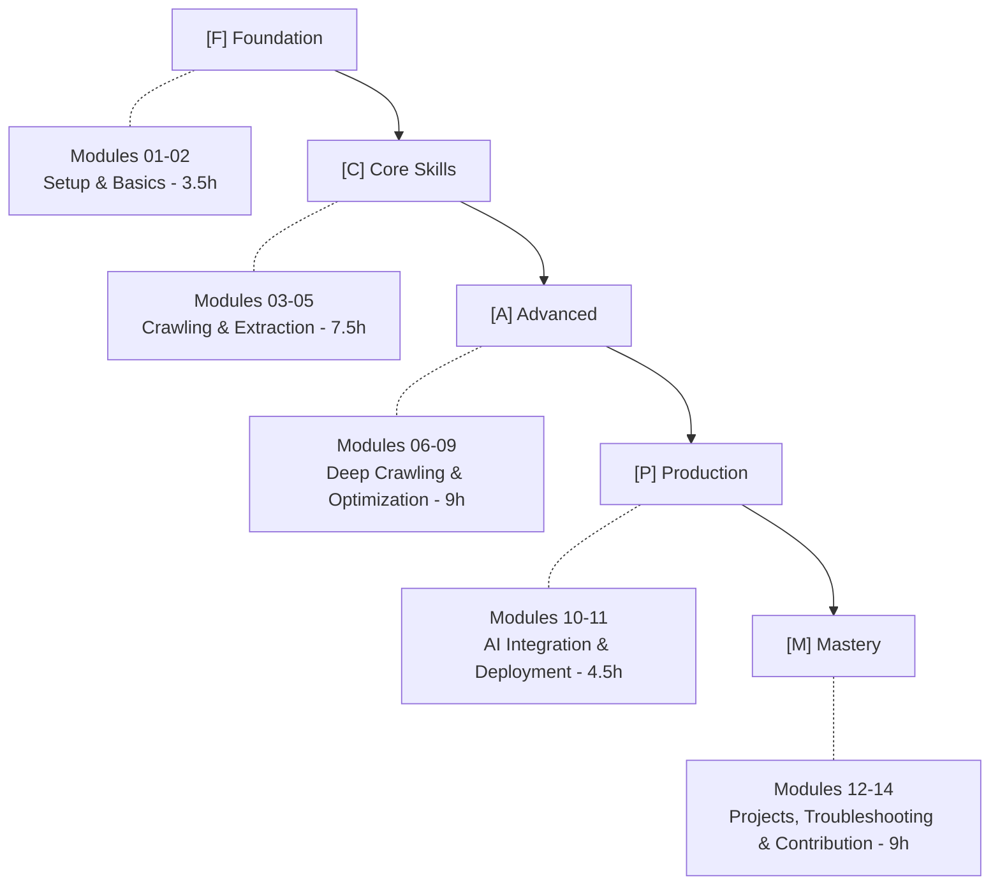

# Mastering Crawl4AI: AI-Powered Web Crawling and Data Extraction

A comprehensive curriculum for building production-ready web crawling solutions with Crawl4AI.

[](./modules)
[](https://www.python.org/)
[](LICENSE)

## Description

Crawl4AI is an AI-optimized web crawler that outputs LLM-ready content. This course takes you from fundamentals to production deployment, covering everything from basic crawling to MCP server integration with AI assistants.

## Course Overview

| Property | Value |
|----------|-------|
| **Total Duration** | 44-50 hours |
| **Modules** | 14 modules |
| **Instructional Content** | 25-30 hours |
| **Hands-on Practice** | 15-20 hours |
| **Capstone Project** | 4-6 hours |

## Prerequisites

- Python 3.12+ knowledge
- Basic understanding of web concepts (HTML, CSS, HTTP)
- Familiarity with async/await concepts (helpful but not required)

## Target Audience

- Developers familiar with Python basics
- Data engineers and AI practitioners
- Anyone interested in web scraping for LLM applications

## Quick Navigation

- [Module 01: Introduction to Crawl4AI](./modules/module-01-introduction.md)
- [Module 02: Installation and Setup](./modules/module-02-installation.md)
- [Module 03: Basic Crawling Fundamentals](./modules/module-03-basic-crawling.md)
- [Module 04: Configuration Deep Dive](./modules/module-04-configuration.md)
- [Module 05: Data Extraction Strategies](./modules/module-05-data-extraction.md)
- [Module 06: Advanced Crawling Features](./modules/module-06-advanced-features.md)
- [Module 07: Performance and Optimization](./modules/module-07-performance.md)
- [Module 08: Hooks and Pipeline Customization](./modules/module-08-hooks.md)
- [Module 09: Multi-Page and Deep Crawling](./modules/module-09-deep-crawling.md)
- [Module 10: Integration with AI Systems](./modules/module-10-ai-integration.md)
- [Module 11: Deployment and Production](./modules/module-11-deployment.md)
- [Module 12: Real-World Projects](./modules/module-12-projects.md)
- [Module 13: Troubleshooting and Best Practices](./modules/module-13-troubleshooting.md)
- [Module 14: Contributing to Crawl4AI](./modules/module-14-contributing.md)

## Learning Path



## Installation

### Using uv (Recommended)

```bash
# Create a new project
uv init crawl4ai-course
cd crawl4ai-course

# Install Crawl4AI with all dependencies
uv add crawl4ai

# Install Playwright browsers
playwright install chromium

# Verify installation
crawl4ai-doctor
```

### Using conda

```bash
# Create the environment from environment.yaml
conda env create -f environment.yaml

# Activate the environment
conda activate crawl4i-py312

# Install Playwright browsers
playwright install chromium

# Verify installation
crawl4ai-doctor
```

### Docker

```bash
# Pull pre-built image
docker pull uncornai/crawl4ai:latest

# Run with volume mounting
docker run -v $(pwd):/workspace -p 8000:8000 uncornai/crawl4ai:latest
```

For detailed installation instructions, see [Module 02: Installation and Setup](./modules/module-02-installation.md).

## Getting Started

Begin with Module 01 to understand what Crawl4AI is and how it differs from traditional web scraping tools:

- [Start Module 01](./modules/module-01-introduction.md)

## Required Resources

- Crawl4AI documentation ([official docs](https://docs.crawl4ai.com/))
- LLM API access (OpenAI, Anthropic, Ollama, Azure OpenAI)
- Docker Desktop for containerization sections
- MCP-compatible AI assistant (Claude Desktop, Cursor, or OpenCode)

## Assessment Overview

| Component | Weight | Description |
|-----------|--------|-------------|
| Weekly Quizzes | 20% | Conceptual understanding tests |
| Lab Completion | 30% | Hands-on exercise verification |
| Capstone Project | 35% | Functionality, code quality, documentation |
| Peer Reviews | 10% | Code review participation |
| Course Feedback | 5% | Final survey |

## License

This course material is available under the MIT License. See [LICENSE](LICENSE) for details.
