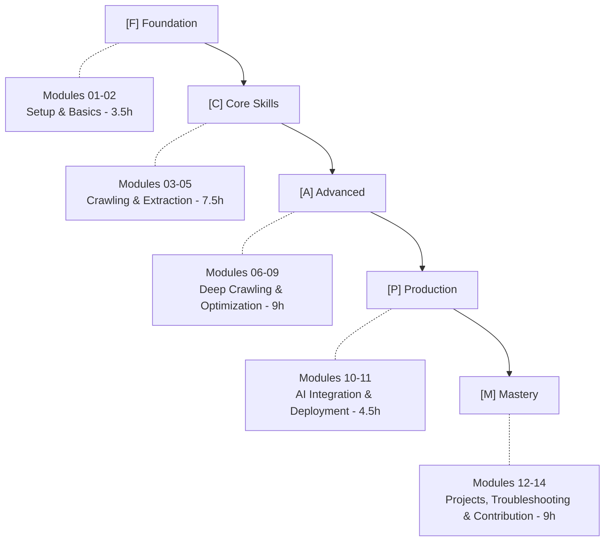

# Mastering Crawl4AI: AI-Powered Web Crawling and Data Extraction

A comprehensive curriculum for building production-ready web crawling solutions with Crawl4AI.

[](./modules)
[](https://www.python.org/)
[](LICENSE)

## Description

Crawl4AI is an AI-optimized web crawler that outputs LLM-ready content. This course takes you from fundamentals to production deployment, covering everything from basic crawling to MCP server integration with AI assistants.

## Course Overview

| Property | Value |
|----------|-------|
| **Total Duration** | 44-50 hours |
| **Modules** | 14 modules |
| **Instructional Content** | 25-30 hours |
| **Hands-on Practice** | 15-20 hours |
| **Capstone Project** | 4-6 hours |
| **Status** | Module 01 Complete ✅ |

## Prerequisites

- Python 3.12+ knowledge
- Basic understanding of web concepts (HTML, CSS, HTTP)
- Familiarity with async/await concepts (helpful but not required)

## Target Audience

- Developers familiar with Python basics
- Data engineers and AI practitioners
- Anyone interested in web scraping for LLM applications

## Quick Navigation

### Completed Modules
- ✅ **Module 01: Introduction to Crawl4AI** - History, fundamentals, and core concepts with working code examples
  - [Module Content](./markdown/module-01-introduction.md)
  - [Code Examples](./src/module01/)

### Modules In Development
- [Module 02: Installation and Setup](./markdown/module-02-installation.md)
- [Module 03: Basic Crawling Fundamentals](./markdown/module-03-basic-crawling.md)
- [Module 04: Configuration Deep Dive](./markdown/module-04-configuration.md)
- [Module 05: Data Extraction Strategies](./markdown/module-05-data-extraction.md)
- [Module 06: Advanced Crawling Features](./markdown/module-06-advanced-features.md)
- [Module 07: Performance and Optimization](./markdown/module-07-performance.md)
- [Module 08: Hooks and Pipeline Customization](./markdown/module-08-hooks.md)
- [Module 09: Multi-Page and Deep Crawling](./markdown/module-09-deep-crawling.md)
- [Module 10: Integration with AI Systems](./markdown/module-10-ai-integration.md)
- [Module 11: Deployment and Production](./markdown/module-11-deployment.md)
- [Module 12: Real-World Projects](./markdown/module-12-projects.md)
- [Module 13: Troubleshooting and Best Practices](./markdown/module-13-troubleshooting.md)
- [Module 14: Contributing to Crawl4AI](./markdown/module-14-contributing.md)

## Learning Path



## Installation

### Using uv (Recommended)

```bash
# Create a new project
uv init crawl4ai-course
cd crawl4ai-course

# Install Crawl4AI with all dependencies
uv add crawl4ai

# Install Playwright browsers
playwright install chromium

# Verify installation
crawl4ai-doctor
```

### Using conda

```bash
# Create the environment from environment.yaml
conda env create -f environment.yaml

# Activate the environment
conda activate crawl4i-py312

# Install Playwright browsers
playwright install chromium

# Verify installation
crawl4ai-doctor
```

### Docker

```bash
# Pull pre-built image
docker pull uncornai/crawl4ai:latest

# Run with volume mounting
docker run -v $(pwd):/workspace -p 8000:8000 uncornai/crawl4ai:latest
```

For detailed installation instructions, see [Module 02: Installation and Setup](./markdown/module-02-installation.md).

## Getting Started

Begin with Module 01 to understand what Crawl4AI is and how it differs from traditional web scraping tools:

- [Start Module 01](./markdown/module-01-introduction.md)

### Module 01: What's New

Module 01 has been updated with comprehensive hands-on code examples covering:

1. **Basic Web Crawling** - Your first Crawl4AI crawler
2. **Async/Await Pattern** - Understanding Python async in Crawl4AI
3. **Context Managers** - Proper resource management
4. **CrawlResult Structure** - Working with crawl output

Each concept includes working Python code examples located in `src/module01/` that use the official practice websites:
- `https://www.scrapethissite.com/` - Beginner-friendly practice site
- `https://books.toscrape.com/` - E-commerce simulation
- `https://web-scraping.dev/` - Advanced testing ground

To run the examples:
```bash
# Test Module 01 code examples
python src/module01/concept_01_what_is_crawling.py
python src/module01/concept_02_async_await_pattern.py
python src/module01/concept_03_context_managers.py
python src/module01/concept_04_crawl_result.py
```

## Required Resources

- Crawl4AI documentation ([official docs](https://docs.crawl4ai.com/))
- LLM API access (OpenAI, Anthropic, Ollama, Azure OpenAI)
- Docker Desktop for containerization sections
- MCP-compatible AI assistant (Claude Desktop, Cursor, or OpenCode)

## Code Examples

Each module includes working Python code examples that follow these principles:

- **Python 3.12+** - Modern syntax and type hints
- **Best Practices** - Docstrings, clean structure, comprehensive comments
- **Practice Websites** - Uses official course practice sites
- **Tested** - All examples verified to work correctly
- **Educational** - Explains the "why" behind each concept

### Module 01 Code Examples

Located in `src/module01/`:

| File | Description | Practice Site |
|------|-------------|---------------|
| `concept_01_what_is_crawling.py` | Basic web crawling demonstration | scrapethissite.com |
| `concept_02_async_await_pattern.py` | Async/await pattern with Crawl4AI | books.toscrape.com |
| `concept_03_context_managers.py` | Context manager usage | books.toscrape.com, scrapethissite.com |
| `concept_04_crawl_result.py` | CrawlResult structure deep-dive | web-scraping.dev |

All examples can be run directly:
```bash
python src/module01/concept_01_what_is_crawling.py
```

## Utilities

The `src/utilities/` directory contains debugging and inspection utilities to help you understand Crawl4AI's behavior and output structure.

### Available Utilities

#### 1. inspect_links.py
Inspect the structure of links extracted by Crawl4AI.

**Purpose:** Understand how Crawl4AI categorizes and structures links (internal vs external).

**Usage:**
```bash
python src/utilities/inspect_links.py
```

**Example Output:**
```
============================================================
Link Inspection Results for: https://example.com
============================================================
Type: dict
Is Dictionary: True
Keys: ['internal', 'external']

Link Counts:
  Internal links: 0
  External links: 1

Example External Link:
  URL: https://iana.org/domains/example
  Text: Learn more
============================================================
```

#### 2. inspect_attributes.py
Inspect all available attributes on the CrawlResult object.

**Purpose:** Discover what data is available after crawling a page.

**Usage:**
```bash
python src/utilities/inspect_attributes.py
```

**Example Output:**
```
============================================================
CrawlResult Attribute Inspection for: https://example.com
============================================================
Total Attributes Found: 0

Key Attributes Summary:
  success        : True
  markdown       : 166 characters
  html           : <!DOCTYPE html>...
  links          : 1 total links
  media          : 0 media items
  metadata       : {'title': 'Example Domain', ...}
  status_code    : 200
============================================================
```

### When to Use These Utilities

Use `inspect_links.py` when:
- You want to understand link extraction structure
- You need to debug link filtering issues
- You're learning how Crawl4AI categorizes links

Use `inspect_attributes.py` when:
- You're exploring CrawlResult capabilities
- You need to know what data is available
- You're debugging attribute access issues

**Note:** These are **development utilities** for debugging and exploration. They are not part of the main educational content but can help you understand Crawl4AI's behavior better. For learning Crawl4AI, start with the main concept examples in `src/module01/`.

## Assessment Overview

| Component | Weight | Description |
|-----------|--------|-------------|
| Weekly Quizzes | 20% | Conceptual understanding tests |
| Lab Completion | 30% | Hands-on exercise verification |
| Capstone Project | 35% | Functionality, code quality, documentation |
| Peer Reviews | 10% | Code review participation |
| Course Feedback | 5% | Final survey |

## License

This course material is available under the MIT License. See [LICENSE](LICENSE) for details.
